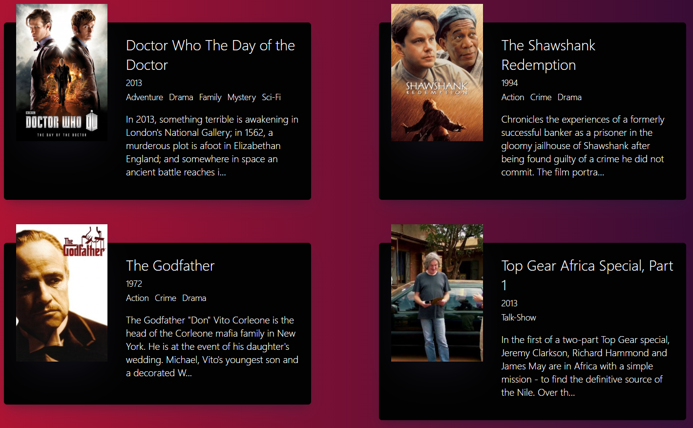

# React Movie App
  - React Fundamental Learning Course with Nomadcoder
  - This project was bootstrapped with [Create React App](https://github.com/facebook/create-react-app)
  
## Link
  - https://chicori3.github.io/movie_app

## What Learned
  - What is React
  - JSX (Javascript XML looks like HTML)
  - React componnents
  - Fetching API
  - There's more to learn...
  
## Image
  
